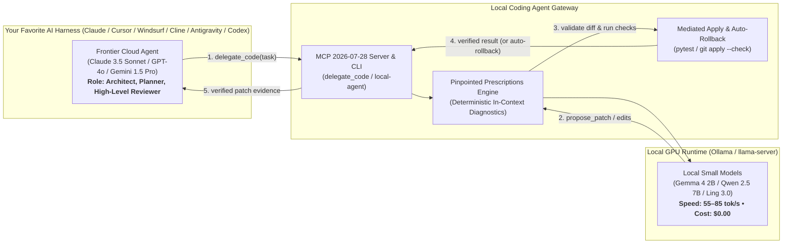

<div align="center">

# ⚡ Local Coding Agent

**Autonomous co-processor delegating atomic coding sub-tasks from ANY AI Harness (Cursor, Windsurf, Claude Code, Cline, Antigravity, OpenCode, Codex) to local Ollama & llama.cpp models with zero-risk sandboxing and guaranteed diff validation.**

[](https://github.com/pvnc228/local-coding-agent/actions/workflows/ci.yml)
[](pyproject.toml)
[](https://www.python.org/downloads/)

[](https://modelcontextprotocol.io)
[](tests/)
[](LICENSE)


[Quickstart](#-2-minute-quickstart) • [Agent Skill](#-agent-skill-integration-skillslocal-coding-agentskillmd) • [CLI Commands](#-complete-cli-command-reference-fool-proof-console-control) • [Benchmarks](#-benchmarks--token-savings) • [Architecture](docs/ARCHITECTURE.md) • [Protocol](docs/PROTOCOL.md)

</div>

---

## 💡 The Core Idea: One-Click Integration with ALL AI IDEs

You don't need to change your daily workflow. You write code in your favorite AI environment (**Cursor, Windsurf, Claude Desktop & Code, Cline / Roo Code, ChatGPT Codex, Google Antigravity, or OpenCode**).

1. **Install the MCP server & Agent Skill once** (`local-agent init-mcp --auto --write && local-agent init-skill --write`).
2. **Prompt your primary agent as usual**: *"Refactor `auth.py`, implement token refresh and run tests"*.
3. **Your primary agent automatically delegates micro-coding sub-tasks** via the `delegate_code` MCP tool to your local Ollama or llama-server runtime (2B–7B models).
4. **Local model writes and verifies the patch in 2–4 seconds** at 80+ tok/s for **$0.00**, protected by automatic sandboxing and post-test rollbacks.



---

## 🚀 NEW in v0.4.0: Pinpointed Prescriptions Engine

Why do small models (2B–4B) usually fail in typical agent setups? Because when they make a formatting error, traditional agents return generic messages like `"Invalid response: candidate rejected"`. Small models lack the deductive reasoning to self-audit schema errors from generic feedback, so they loop infinitely and crash.

**Local Coding Agent v0.4.0** introduces a deterministic, rule-based **Pinpointed Prescriptions Engine** (`local_coding_agent.prescriptions`):

### 🔍 Before vs After: Real-World Behavior on 2B Models

| Traditional Agent (Fails) | Local Coding Agent v0.4.0 (Succeeds) |
| :--- | :--- |
| **Model Mistake:** Model places text into test array: `checks: ["modified file"]` | **Model Mistake:** Same syntax error |
| ❌ **Agent Feedback:** `"Validation failed: response rejected. Try again."` | ✅ **Pinpointed Prescription:** `{"error": "ERR_CHECKS_TYPE", "hint": "The 'checks' field must be an empty array []. Replace with 'checks': []"}` |
| 📉 **Result:** 2B model panics, repeats the error, runs out of turns. | 📈 **Result:** Model replaces the single field in 1 turn and immediately passes! |

> 🔒 **Zero Distillation Guarantee:** All prescriptions are computed strictly by deterministic Python rules. No host model reasoning or proprietary prompt logic is distilled into the local model.

---

## 📊 Benchmarks & Token Savings

### 🏆 Multi-Module Macro-Benchmark (Real Architecture Refactor)
Testing full multi-file implementation: Key-Value Storage + TTL Engine + Write-Ahead Log + Integration Test Suite on an NVIDIA RTX 4060 (8 GB VRAM):

| Model Profile | Parameters / Quant | VRAM | Eval Speed | Subtasks Solved | Full Suite Passed | Local Execution Cost |
| :--- | :---: | :---: | :---: | :---: | :---: | :---: |
| **`gemma4-e4b-q4`** | 4.5B (Q4_K_M) | **2.96 GB** | **54.9 tok/s** | **3 / 3 (100%)** | **PASSED (100%)** ✅ | **$0.00 (100% Free)** |
| **`gemma4-e2b-q4`** | 2.5B (Q4_K_M) | **1.63 GB** | **84.2 tok/s** | **2 / 3 (66.7%)** | Mediated Rollback 🛡️ | **$0.00 (100% Free)** |
| **`qwen3-8b-q6k`** | 8.0B (Q6_K) | **8.20 GB** | **85.0 tok/s** | **3 / 3 (100%)** | **PASSED (100%)** ✅ | **$0.00 (100% Free)** |

> 💡 **Token Savings:** Running these tasks locally saved ~15,000–22,000 cloud tokens per run. Routine coding work runs completely free on your local GPU.

---

## ⚡ 2-Minute Quickstart

### 🤖 Auto-Setup via Your Coding Assistant

If you are already in an AI coding assistant (**Cursor, Windsurf, Claude Code, Cline, Antigravity, OpenCode, Codex**), just paste this one prompt:

```text
Install and configure https://github.com/pvnc228/local-coding-agent:
1. Run `pip install -e .[mcp]`
2. Run `python -m local_coding_agent doctor` to verify Ollama status
3. Run `python -m local_coding_agent init-mcp --auto --write` to register the MCP server
4. Run `python -m local_coding_agent test-run --mock` to verify sandbox execution
```

---

### 🛠 Manual Step-by-Step

**Requirements**: Python 3.10+, [Ollama](https://ollama.com) (or any OpenAI-compatible llama.cpp server), and **git** on `PATH` (patch apply/rollback is git-based).

#### 1. Install package & dependencies
```bash
pip install -e .[mcp]
# or from a wheel (all subpackages are packaged):
pip install local_coding_agent[mcp]
```

#### 2. Run system diagnostic check
```bash
local-agent doctor
```

```text
============================================================
  Local Coding Agent — System Diagnostic Wizard
============================================================
[OK]   Python Runtime: Python 3.13.3
[OK]   Git Executable: git version 2.47.1
[OK]   Host Memory: RAM: 32 GB total (13 GB available)
[OK]   Ollama API: Connected to http://127.0.0.1:11434 (latency: 26ms)
============================================================
  Overall Status: READY (All critical checks passed)
============================================================
```

#### 3. Register MCP Server into all installed IDEs
```bash
# Automatically detects and configures all installed AI editors:
local-agent init-mcp --auto --write

# Or register individually:
local-agent init-mcp --cursor --write       # Cursor Composer
local-agent init-mcp --windsurf --write     # Windsurf Flow / Cascade
local-agent init-mcp --claude --write       # Claude Desktop & Claude Code
local-agent init-mcp --cline --write        # Cline & Roo Code
local-agent init-mcp --antigravity --write  # Google Antigravity & agy CLI
local-agent init-mcp --opencode --write     # OpenCode Studio & CLI
local-agent init-mcp --codex --write        # Codex Desktop & Codex CLI
```

#### 4. Install Agent Skill
```bash
# Automatically install Agent Skill into Codex, Antigravity, Claude, or workspace:
local-agent init-skill --write
```

#### 5. Run End-to-End Verification
```bash
local-agent test-run --mock
```

### 🧹 Uninstall / Cleanup

`init-mcp --write` merges an entry into your MCP client config and `init-skill --write`
copies a `SKILL.md`. To remove them:
- Reopen the client config file printed by `local-agent init-mcp --dry-run --client <name>` and delete the `local-coding-agent` server entry.
- Delete the `SKILL.md` directory printed by `local-agent init-skill --dry-run`.
- Remove the package with `pip uninstall local-coding-agent`.

---

## 🧠 Agent Skill Integration (`skills/local-coding-agent/SKILL.md`)

`local-coding-agent` includes a dedicated **Agent Skill** designed to give coding agents (Claude Code, Cursor, Windsurf, Roo Code, ChatGPT Codex, Google Antigravity) precise guidelines on:
- **Decision Matrix**: When to offload micro-tasks to the local model vs solve directly.
- **Task Envelope Formulation**: Crafting optimal `goal`, allowlisted `files`, `constraints`, and `checks`.
- **Profile Selection**: Auto-selecting the right model size based on available VRAM and speed.
- **Safe Proposal Application**: Validating diffs with mediated apply and post-test rollback.

```bash
# Preview or install the skill:
local-agent init-skill --write          # Installs into all detected agent skill locations
local-agent init-skill --print          # Dumps SKILL.md to console
```

---

## 🛡️ Core Safety Guarantees

1. **Strict File Allowlisting**: The local model can only inspect or modify files explicitly specified in the task envelope. Absolute paths or `..` traversals are rejected.
2. **Proposal-Only Default**: The local model never directly writes to disk. It outputs structured SEARCH/REPLACE blocks or unified diffs.
3. **Mediated Apply with Rollback**: When a patch is applied, the controller automatically executes allowlisted verification tests (`pytest`). If any test fails, changes are **immediately rolled back** to ensure workspace integrity.
4. **No Self-Reported Success**: Claims by the model that tests passed without external verification runner evidence are rejected.
5. **100% CLI Parity**: Every feature is manageable through the console for non-MCP agents or terminal pipelines.

---

## 📈 Real-Time Monitoring & Web Dashboard

Launch the built-in HTTP server to inspect active worker pool load, queue latency, and live tokens per second:

```bash
local-agent monitor --port 8765
```

Open `http://127.0.0.1:8765/dashboard` in your browser for the real-time visual monitor.

Every delegation (`local-agent delegate`, MCP `delegate_code`, `DelegationService.delegate`)
appends a record to `.local-run/stats.jsonl`; the dashboard aggregates that journal, so
`/stats` shows real cross-process traffic even though delegations run in other terminals.

---

## 💬 Interactive Chat & Sessions

```bash
# Single-shot prompt (auto-classifies chat/build/plan mode):
local-agent chat "explain what context_manager.py does"

# Multi-turn REPL with persistent session history:
local-agent chat --repl
local-agent chat --repl --session-id my-session     # create/resume a named session

# List and inspect persisted sessions:
local-agent sessions list
local-agent sessions show <session_id>
```

### Model selection

```bash
# Any installed model tag, even without a registered profile:
local-agent delegate --task task.json --model qwen2.5-coder:7b
```

Defaults can be overridden via environment variables: `LCA_PROFILE` (profile name,
default `qwen2.5-coder`) and `LCA_WORKSPACE` (workspace directory).

---

## 📚 Complete CLI Command Reference (Fool-Proof Console Control)

| Subcommand | Description | Example Usage |
| :--- | :--- | :--- |
| `local-agent delegate` | Delegate an atomic coding task to a local model. | `local-agent delegate --task task.json --json` |
| `local-agent decompose` | Preflight and split wide tasks into atomic envelopes. | `local-agent decompose --task wide.json --strategy by_files --json` |
| `local-agent profiles` | List and inspect registered model profiles. | `local-agent profiles list --json` |
| `local-agent memory` | Query VRAM allocation, unload models, enforce limits. | `local-agent memory enforce --limit 8000000000 --keep qwen3-8b-q6k:latest` |
| `local-agent calibrate` | Calculate worker concurrency bounds from VRAM budget. | `local-agent calibrate --vram-bytes 16000000000 --profile qwen2.5-coder` |
| `local-agent apply` | Apply a patch to workspace with verification & auto-rollback. | `local-agent apply --patch-file patch.diff --workspace . --check "pytest tests/"` |
| `local-agent init-skill` | Export/install Agent Skill into agent skill directories. | `local-agent init-skill --write` |
| `local-agent doctor` | Automated diagnostics for Ollama API, Git CLI, RAM/VRAM, and model catalog. | `local-agent doctor --json` |
| `local-agent init-mcp` | Multi-client configuration generator & merger for all major AI harnesses. | `local-agent init-mcp --auto --write` |
| `local-agent test-run` | Self-contained atomic smoke tests with live TPS and diff validation. | `local-agent test-run --mock` |
| `local-agent serve-mcp` | Start official-SDK MCP stdio server with Tasks extension support. | `local-agent serve-mcp --workspace . --enable-tasks` |
| `local-agent monitor` | Start the lightweight HTTP observability server & live web dashboard. | `local-agent monitor --port 8765` |
| `local-agent benchmark` | Execute the reproducible proposal-only benchmark suite. | `local-agent benchmark --repeats 3 --json` |
| `local-agent chat` | Single-shot or `--repl` multi-turn interactive chat with session history. | `local-agent chat --repl --session-id my-session` |
| `local-agent sessions` | List persisted sessions or show a full event trace. | `local-agent sessions list` |


---

## 📄 Documentation

- **[docs/QUICKSTART.md](docs/QUICKSTART.md)** — 60-second quickstart guide.
- **[docs/ARCHITECTURE.md](docs/ARCHITECTURE.md)** — Controller architecture, worker pool, and prescriptions engine.
- **[docs/MCP_INTEGRATION.md](docs/MCP_INTEGRATION.md)** — Model Context Protocol (MCP 2026-07-28) integration guide.
- **[docs/PROTOCOL.md](docs/PROTOCOL.md)** — Communication protocol and SEARCH/REPLACE specifications.
- **[docs/BENCHMARK.md](docs/BENCHMARK.md)** — Benchmarking methodology, TPS measurements, and model evaluation.

---

## ⚖️ License

Distributed under the **MIT License**. See [LICENSE](LICENSE) for details.
