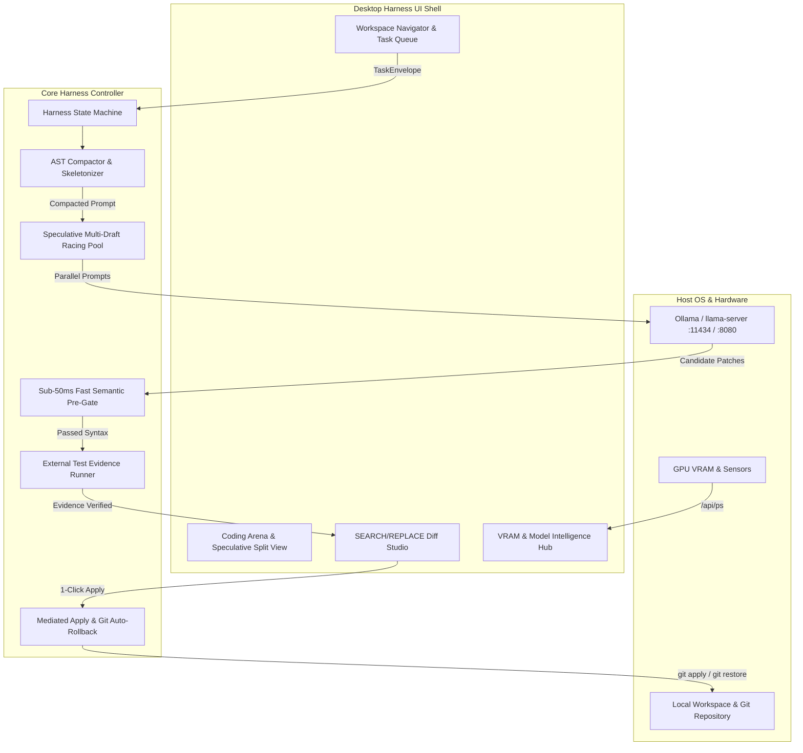

# Standalone Desktop AI Coding Harness — Architecture & UI/UX Specification

## 1. Executive Summary & Vision

The **Desktop AI Coding Harness** (`local-agent desktop`) is a dedicated, native developer cockpit designed to orchestrate small local LLMs (1B–14B parameters running via Ollama, llama-server / llama.cpp, or vLLM) for atomic software engineering tasks.

Unlike a browser-based web dashboard (which is constrained by browser sandboxing, lacks native file-system events, and competes with heavy browser tabs for RAM), the **Desktop Harness** acts as a native control center with:
- **Zero-Friction Workspace Binding**: Real-time git status tracking, native directory picking, and file watching.
- **Low RAM Overhead**: Ultra-lean native desktop shell (<50MB RAM footprint) ensuring maximum host RAM/VRAM is preserved for local inference.
- **Visual Speculative Racing Arena**: Real-time side-by-side comparison of competing model drafts (e.g. `qwen2.5-coder` vs `ling-3.0-tiny-q6k`).
- **Interactive AST Compactor & Skeletonizer**: Visual token-reduction studio allowing developers to see exact prompt shrinkage prior to dispatch.
- **GitHub-Grade Diff & SEARCH/REPLACE Studio**: Character-exact hunk inspection, interactive hunk cherry-picking, and 1-click apply with auto-rollback.
- **Hardware & VRAM Telemetry Cockpit**: Live GPU memory pressure gauges, context window fill meters, and background process controls.

---

## 2. Desktop UI Aesthetic & Dual-Mode Architecture (LM Studio Style)

Вместо перегруженного интерфейса VS Code, десктопный Harness выполнен в **графитовом минималистичном стиле LM Studio / Linear**:

1. **Компактные системные индикаторы в верхнем левом углу**:
   - Миниатюрные цветные pills/кружки (`GPU VRAM: 5.8GB`, `Model: Qwen 2.5 Coder`, `Context: 2.1k`) расположены под заголовком окна слева, не отвлекая и не загромождая рабочее пространство.
2. **Вкладочная навигация верхнего уровня**:
   - **`Interactive Chat` (Интерактивный чат)**: пользователь управляет ходом разработки в свободной диалоговой форме. Бэкенд декомпозирует запрос: *Задача 1* (обдумывание/планирование и сбор TaskEnvelope) $\rightarrow$ *Задача 2* (исполнение и проверка тестами), выдавая пользователю бесшовный опыт уровня Claude Code. Чат расположен в центре, а живой дифф изменений — в правой трети окна.
   - **`Delegated Tasks` (Делегированные задачи)**: режим детальной инспекции задач, пришедших от внешних хост-агентов (Codex, Claude, Antigravity) с карточкой Task Envelope слева и полноразмерным SEARCH/REPLACE сплит-диффом справа.
   - **`Configuration / Models`**: управление локальными моделями, VRAM и тестами.

---

## 3. Core System Architecture & Data Flow



---

## 4. UI / UX Design & Wireframes

The desktop interface utilizes a **3-Column IDE-Grade Cockpit**:

### Main Layout Overview

```
+--------------------------------------------------------------------------------------------------------------------+
|  [Logo] Local Coding Harness v0.7.0     Workspace: /home/dev/my-project (main*)            [Ollama: Online] [VRAM: 6.2/16GB] |
+-------------------+--------------------------------------------------------------+---------------------------------+
| WORKSPACE & QUEUE | INTERACTIVE CODING ARENA & DIFF STUDIO                       | HARDWARE & TELEMETRY            |
|                   |                                                              |                                 |
| [Select Workspace]| Task Goal: [Fix off-by-one error in sliding window index    ] | Active Profile: qwen2.5-coder   |
|                   |                                                              | VRAM Used: [████████░░░░] 6.2 GB|
| Modified Files:   | Allowlisted Files: [src/window.py      ] [+ Add File]        | Context:   [████░░░░░░░░] 1.8k  |
| - src/window.py*  | Targeted Checks:   [pytest tests/test_window.py]             | Gen Speed: 78.4 tok/s           |
| - tests/test_w.py | Model Dispatch:    [qwen2.5-coder v] [x] Speculative Drafts   | Hardware Tier: Tier 2 (8B Work) |
|                   |                                                              |                                 |
| Preset Envelopes: | [ RUN DELEGATION (Ctrl+Enter) ]    [ SKELETONIZE PREVIEW ]   | ------------------------------- |
| > Bug Fix         |                                                              | PINPOINTED PRESCRIPTIONS        |
| > Unit Test Gen   | ------------------------------------------------------------ |                                 |
| > Fast Refactor   | Tabs: [ Split Diff ]  [ Speculative Racing ]  [ AST Context ]| [OK] SEARCH block aligned       |
|                   |                                                              | [OK] Imports resolved           |
| Task History:     |  BEFORE: src/window.py       | AFTER: src/window.py          | [OK] Ruff check clean (18ms)    |
| [V] req-fix-01    |  42  for i in range(len(w)): | 42  for i in range(len(w)-1): |                                 |
| [X] req-ref-02    |  43      total += w[i]       | 43      total += w[i]         | ------------------------------- |
| [.] req-fix-03    |  44      return total        | 44      return total          | TEST EVIDENCE                   |
|                   |                                                              | [PASS] pytest tests/test_w.py   |
|                   | ------------------------------------------------------------ | Ran: 4 passed in 0.42s          |
|                   | [ APPLY PROPOSAL (Ctrl+A) ]  [ AUTO-ROLLBACK ]  [ RE-PROMPT ]| External verified: TRUE         |
+-------------------+--------------------------------------------------------------+---------------------------------+
| Ready | Engine: Harness State Machine | Turn 1/4 | Last run: 1.2s | Memory Clean                                    |
+--------------------------------------------------------------------------------------------------------------------+
```

---

## 5. Detailed Panel Functionality

### 5.1 Left Sidebar: Workspace & Session Hub
- **Workspace Switcher**: Instant switching between active repositories. Shows active git branch and uncommitted dirty files.
- **Envelope Preset Library**: Quick-start templates for:
  - *Atomic Bugfix*: 1 file, 1 targeted pytest check.
  - *Unit Test Creation*: 1 source file + 1 test file.
  - *Type & Docstring Annotator*: Auto-fills constraints for pure types/docstrings.
  - *Refactoring*: Bounded symbol refactoring with regression tests.
- **Task History & Queue**: Persistent list of delegation runs (`JsonFileTaskStore`) with instant recall of past diffs, logs, and prescriptions.

### 5.2 Central Panel: Interactive Coding Arena & Diff Studio
- **Envelope Form**: Clean input fields for Goal, Files (with auto-complete file picker), Checks (test command), and Constraints.
- **Compaction & Skeletonize Preview**: Toggling `[SKELETONIZE PREVIEW]` shows an instant before/after token comparison showing how `ast_compactor.py` collapses non-target symbols.
- **Speculative Multi-Draft Racing Tab**:
  - Live side-by-side execution cards when speculative drafts $\ge 2$.
  - Displays Draft A (`qwen2.5-coder` @ temp 0.0) vs Draft B (`ling-3.0-tiny` @ temp 0.2).
  - Shows generation speed, static linter latency, and test oracle resolution time.
  - Highlights the winning candidate automatically.
- **Side-by-Side Diff Inspector**:
  - Interactive Monaco Diff view.
  - Character-level SEARCH/REPLACE visualization.
  - Interactive hunk cherry-picking checkbox for partial applies.
- **Action Control Bar**:
  - **`[ Apply Proposal ]`** (Green): Executes mediated apply, runs targeted tests, and validates working tree.
  - **`[ Auto-Rollback ]`** (Amber/Red): Instant `git restore` back to clean state.
  - **`[ Retry with Prescription ]`** (Blue): Injects the Pinpointed Prescription directly into prompt constraints and re-runs.

### 5.3 Right Sidebar: Telemetry & Prescriptions Cockpit
- **Live VRAM Pressure Gauge**: Radial gauge showing dedicated VRAM usage, shared system RAM, and temperature/thermal status.
- **Context Window Meter**: Visual indicator of token usage against `num_ctx` limit (e.g. `1,840 / 8,192 tokens (22%)`).
- **Pinpointed Prescriptions Log**: Explains why a model draft failed (e.g. "SEARCH block mismatch on line 42") and displays the generated repair prescription.
- **Capability Tier Card**: Shows the active model's capability score (Tier 0–4), verified languages, and recommended task granularity.
- **1-Click Maintenance (`doctor --fix`)**: Quick button to download missing model quants or configure host IDE MCP links.

---

## 6. Keyboard Shortcuts & Power Workflows

| Shortcut | Action |
|---|---|
| `Ctrl+Enter` / `Cmd+Enter` | Run Task Delegation / Racing |
| `Ctrl+A` / `Cmd+A` | Apply Winning Proposal (with verification) |
| `Ctrl+R` / `Cmd+R` | Auto-Rollback (`git restore`) |
| `Ctrl+P` / `Cmd+P` | Quick-select allowlisted file in workspace |
| `Ctrl+K` / `Cmd+K` | Skeletonize selected file for target symbol |
| `Ctrl+Shift+D` | Open Decompose Wizard for wide tasks |

---

## 7. Implementation Roadmap & Milestones

1. **Step 1 — Zero-Friction Native Shell (Phase 1)**:
   - Implement `local_coding_agent/desktop/` module using `pywebview`.
   - Embed high-performance single-page application bundle (Tailwind + Monaco + Chart.js).
   - Expose Python IPC endpoints connecting directly to `Controller`, `BoundedWorkerPool`, and `ModelMemoryManager`.
   - Add `local-agent desktop` CLI command.
2. **Step 2 — Speculative Racing Split Screen**:
   - Implement real-time SSE / IPC streaming to render dual draft progress bars and simultaneous diff generation.
3. **Step 3 — Standalone Tauri v2 Binary (Phase 2)**:
   - Package standalone Rust shell with zero Python runtime dependency for distributing pre-compiled native binaries.
